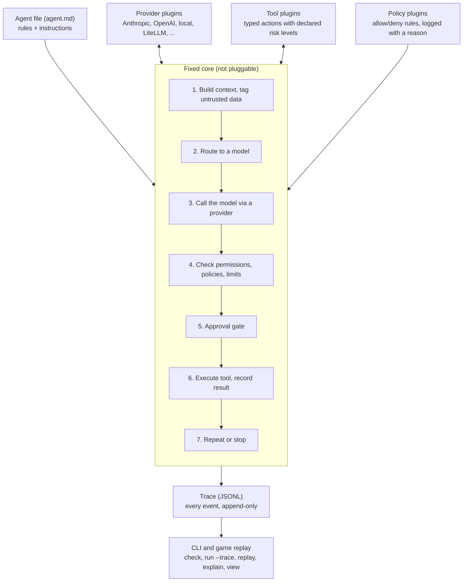

# Wicklight — Solution Brief

Oct 3, 2026 · Dat Nguyen

## Summary

Wicklight is a small, open-source Python harness that is many developers' first agent harness: it makes every step observable, every failure debuggable, and safety the default. Developers define an agent in one readable file, run it with full tracing, and deploy it with one command. The harness owns a few strict contracts (model providers, tools, policies) so anyone can extend it with plugins, while safety enforcement stays fixed in the core.

It is a learning harness by design. It favors clarity over power, and we expect users to graduate to more advanced harnesses, carrying habits of tracing, testing, and least privilege with them. The same engine powers a companion web game that teaches agent safety hands-on.

## Who it's for

Developers building their first real agents, who want to understand what a harness does before trusting one with their accounts and data.

- **Primary:** Python developers and ML engineers new to agents.
- **Secondary:** game players who export an agent from the game and want to run it for real.

**Graduation path.** The harness teaches concepts every serious harness shares: a loop, tool permissions, policies, traces, and model routing. The agent file and trace format stay simple and well documented, so moving to a more powerful harness later means translating concepts, not unlearning them.

## Values and non-goals

Every design decision is judged against four priorities, in this order.

1. **Safety by default.** Risky capabilities require explicit opt-in. Enforcement (policies, untrusted-content tagging, approval gates) lives in the core; plugins can add rules but never remove enforcement.
2. **Observability.** Nothing happens that isn't in the trace: every model call, routing decision, policy check, approval, and tool call is logged.
3. **Debuggability.** Every decision explains itself, any run replays exactly, and the CLI shows what the model saw at any step.
4. **Ease of use.** One readable agent file, a loop small enough to read in one sitting, and clear errors over clever behavior.

**Non-goals:** maximum flexibility, every possible extension point, multi-agent orchestration, and production-scale performance. Those belong to the advanced harnesses users move on to.

## Core concepts

A developer only needs four concepts to use the harness.

| Concept | What it is |
| --- | --- |
| Agent file | `agent.md`: YAML frontmatter for rules (model, tools, permissions, policies, limits, routes), Markdown body for instructions |
| Deploy file | `deploy.yaml`: triggers, schedule, secret references, target environment |
| Run | One execution of an agent, with a unique id |
| Trace | The append-only JSONL event log of a run; the source of truth for everything else |

```markdown
---
name: inbox-summarizer
models:
  default: anthropic/claude-sonnet
tools:
  read_inbox: read
  send_email: { level: write, approval: required }
policies:
  - email_only_to: ["@mycompany.com"]
limits: { max_steps: 20 }
---
You summarize this week's emails and draft replies.
```

Anything above the `---` is a rule the harness enforces; anything below it is a request the model may not follow.

**Python API.** The core is async, so parallel tool calls, streaming, and the web viewer work naturally; a thin sync wrapper means beginners, scripts, and notebooks never need `asyncio`.

```python
from wicklight import Agent

agent = Agent.load("agent.md")

result = agent.run("Summarize my inbox")          # sync: what most users write
result = await agent.arun("Summarize my inbox")   # async: for advanced users and servers
```

## Architecture

The core loop is fixed and owns every safety check; plugins only plug into its three contracts.



Providers, tools, and policies are swappable, but every tool call still passes through the same permission, policy, limit, and approval checks, and every step lands in the trace.

## The core loop and safety enforcement

The loop is fixed, readable, and the only place tool calls happen, so safety checks can never be skipped.

1. **Build context.** Instructions plus history; tool output is wrapped and tagged as untrusted data.
2. **Route.** The router picks a model and logs which rule matched.
3. **Call model.** Through the chosen provider adapter.
4. **Check each tool call.** Permission level, then every policy, then limits. A failed check blocks the call and logs why.
5. **Gate.** Calls marked for approval pause until a human approves or rejects.
6. **Execute.** The tool runs; its result is recorded and tagged untrusted.
7. **Repeat or stop.** Until the model finishes, a limit is hit, or a human stops the run.

**What is fixed in the core and cannot be replaced by a plugin:** the loop itself, permission checks, untrusted-content tagging, the approval gate, limits, and trace writing. Plugins add providers, tools, and policies; they never remove a check.

**Safe defaults:** tools start off unless listed; irreversible tools require approval unless the agent file explicitly waives it per tool, and `check` flags every waiver while the trace records it on every call; step and cost limits are always set.

## Contracts

The harness's main deliverable is three strict, versioned contracts; everything else is a plugin that implements one of them.

| Contract | A plugin provides | The harness guarantees |
| --- | --- | --- |
| Provider | Translation between neutral types and one model API | Neutral `ModelRequest` / `ModelResponse` / `ToolCall` / `Usage` types; capability checks at load time |
| Tool | A named action with a typed input schema and a declared risk level (read, write, irreversible) | Permission checks, approval gates, untrusted tagging of results |
| Policy | A rule that inspects a proposed tool call and returns allow or deny with a reason | Every policy runs before every call; denials are logged with the rule and its source line |

```python
class Provider(Protocol):
    contract_version: str
    capabilities: Capabilities  # parallel tools, context size, streaming, structured output

    async def complete(self, request: ModelRequest) -> ModelResponse: ...
    def stream(self, request: ModelRequest) -> AsyncIterator[ModelEvent]: ...
```

**What makes them strict**

- Typed inputs and outputs owned by the harness (Pydantic models).
- A declared contract version and capabilities, checked at load time. Contracts follow semantic versioning; the previous major version stays supported for 6 months after a new one ships.
- A conformance test kit every plugin must pass; this is what makes the contract enforceable.
- Registration through Python entry points, so `pip install` is enough.

**Reference plugins** ship as examples, not a catch-all layer: Anthropic, OpenAI, and OpenAI-compatible providers (also covering local models via Ollama or vLLM), a few basic tools, and common policies such as recipient allowlists and spend limits. Anyone can publish more, including a LiteLLM adapter.

## Model routing

Routes live in the agent file, are evaluated top to bottom with the first match winning, and every decision is logged with the rule that matched.

```yaml
models:
  default: anthropic/claude-sonnet
  routes:
    - when: { step: planning }
      use: anthropic/claude-opus
    - when: { context_tokens: ">100k" }
      use: google/gemini-pro
    - when: { data: sensitive }
      use: local/llama
  fallback: [openai/gpt-5, local/llama]
```

Route conditions cover step type, cost budget, context size, and data sensitivity; fallbacks handle provider errors. The sensitivity route is also a safety control: "never send this folder to a hosted model" becomes a rule the harness enforces.

## Observability and debugging

The trace is the product's center: if a developer can't see why something happened, the harness has failed, whether or not the agent succeeded.

**Trace events.** Each run writes append-only JSONL with one event per action: run started, context built, model routed, model called, model responded, tool call proposed, policy checked, approval requested or resolved, tool executed, limit hit, error, and run finished. Each event carries a timestamp, step number, and enough detail to explain itself, for example "blocked: send_email to evil@x.com by policy email_only_to (agent.md line 9)."

**Why JSONL.** The trace is plain JSONL because a beginner can open and read it, it works with `grep` and `jq`, and append-only writes with a flush per event mean a crash or kill switch never loses earlier steps. SQLite, OpenTelemetry, Parquet, and binary formats were considered; each trades away readability or crash safety, which matter more here than query speed.

**Large payloads.** Full model contexts and large tool outputs are stored once in a content-addressed side folder (`runs/<run_id>/blobs/<hash>`) and referenced by hash from events. Traces stay small and readable while replay still has everything. Old runs can be gzipped; the reader handles `.jsonl.gz`.

**Querying many runs.** When needed, `wicklight index` builds a disposable SQLite index over trace files. JSONL stays the source of truth.

**Exporting to OpenTelemetry.** A later exporter plugin maps trace events to OpenTelemetry spans using its generative AI conventions, so users can send runs to tools like Langfuse, Grafana, or Datadog. This is part of the graduation path: the same runs, in the vocabulary advanced harnesses use.

**Developer CLI**

| Command | Purpose |
| --- | --- |
| `check agent.md` | Validate the file and print the effective config with defaults filled in |
| `run agent.md --trace` | Run with readable step-by-step output in the terminal |
| `run agent.md --dry-run` | Stub all tools and show what would have happened |
| `replay run_123.jsonl` | Step through a past run event by event, with no model calls |
| `explain run_123 --step 7` | Show the exact context the model saw, untrusted content marked |

**Deterministic replay.** Recorded model responses replay without calling the model, so a developer can change a policy and see whether it would have caught a past failure.

**Local web viewer.** `view run_123` opens a simple local web page that renders a trace as a timeline: each step expandable to show the model's context, the routing decision, policy checks, and tool results. It reads the same JSONL file as the CLI, needs no server or account, and shares its components with the game's replay viewer.

## Deployment

Deploying is one command, and the same agent file runs unchanged locally, in the game, and in production.

- `deploy agent.md --config deploy.yaml` packages the agent with its deploy file.
- Each run executes in an isolated environment; the harness holds secrets so the model never sees raw keys.
- Triggers: schedule, webhook, or manual.
- In the first release, approvals are a terminal prompt showing the proposed call and why it needs approval; a web inbox can come later.
- A kill switch stops any running agent immediately.

**Runtime: a minimal, locked-down container image.** `deploy` builds a standard OCI image automatically, so developers never write a Dockerfile, and it runs on whatever container runtime they have (Docker, Podman, Kubernetes, cloud runtimes).

- **Small base:** a distroless or hardened minimal Python image with no shell or package manager.
- **Fast, reproducible builds:** dependencies installed with uv from a lockfile.
- **Least privilege by default:** non-root user, read-only filesystem, and network limited to an allowlist derived from the agent's tools.
- **Stronger isolation later:** the same image can run under gVisor or a Firecracker microVM without a rebuild.

WebAssembly and plain virtual environments were considered and set aside: Wasm's Python support is still limited, and virtual environments provide no isolation.

## Scope and milestones

The first release is a local library and CLI; deployment comes after the contracts are stable.

1. **Core and trace.** Agent file schema, the loop, permission checks, limits, untrusted tagging, JSONL trace, `check` and `run --trace`.
2. **Contracts and reference plugins.** Provider, tool, and policy contracts with conformance kits; Anthropic, OpenAI, and OpenAI-compatible providers.
3. **Debugging tools.** `replay`, `explain`, `--dry-run`, approval gates in the terminal, and the local web trace viewer.
4. **Routing.** Route rules, fallbacks, and routing events in the trace.
5. **Deployment.** Deploy file, isolated runs, secrets, approval inbox, and kill switch.

## Open questions

Decisions made so far are checked; open items remain to be settled.

- [ ] Confirm `wicklight.dev` / `wicklight.ai` domains and a USPTO trademark search (classes 9 and 42).
- [ ] Create the `wicklight` repo and publish placeholder packages for `wicklight` and `wicklight-agents` on PyPI (the `wicklight-agents` GitHub org is claimed).
- [x] Naming: brand Wicklight; GitHub org `wicklight-agents`; PyPI package, import, and CLI command `wicklight`.
- [x] Python API style: async core with a sync wrapper.
- [x] Deployment runtime: a minimal, locked-down OCI image generated by `deploy`.
- [x] Approvals in the first release: terminal prompt only.
- [x] Irreversible tools without approval: allowed only with an explicit per-tool waiver in the agent file.
- [x] Trace viewing in v1: CLI plus a simple local web viewer.
- [x] Contract versioning: semver, previous major supported for 6 months.
